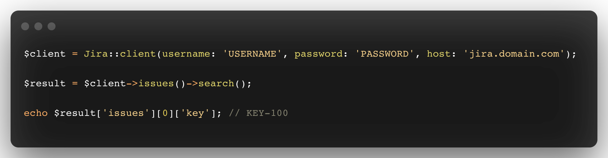

<p align="center">
    
    <p align="center">
        <a href="https://github.com/devmoath/jira-php/actions"></a>
        <a href="https://packagist.org/packages/devmoath/jira-php"></a>
        <a href="https://packagist.org/packages/devmoath/jira-php"></a>
        <a href="https://packagist.org/packages/devmoath/jira-php"></a>
    </p>
</p>

------

**Jira PHP** is a supercharged PHP API client that allows you to interact with the [Jira API](https://docs.atlassian.com/software/jira/docs/api/REST/8.0.0) and the [Service Desk API](https://docs.atlassian.com/jira-servicedesk/REST/5.2.0/).

> This project is a work-in-progress. Code and documentation are currently under development and are subject to change.

## Get Started

> **Requires [PHP 8.1+](https://php.net/releases/)**

First, install `devmoath/jira-php` via the [Composer](https://getcomposer.org/) package manager:

```bash
composer require devmoath/jira-php dev-master
```

Then, interact with Jira's APIs:

```php
$client = Jira::client(username: 'USERNAME', password: 'PASSWORD', host: 'jira.domain.com');

$result = $client->issues()->search();

echo $result['issues'][0]['key']; // KEY-1000
```

## Usage

### `Attachments` Resource

#### `get` function

Retrieve the meta-data for an attachment.

```php
$client
    ->attachments()
    ->get(id: '1000');
```

<details>
<summary>response example</summary>

```php
[
    'self' => 'https://www.example.com/jira/rest/api/2.0/attachments/10000',
    'filename' => 'picture.jpg',
    'author' => [
        'self' => 'https://www.example.com/jira/rest/api/2/user?username=fred',
        'name' => 'fred',
        'avatarUrls' => [
            '48x48' => 'https://www.example.com/jira/secure/useravatar?size=large&ownerId=fred',
            '24x24' => 'https://www.example.com/jira/secure/useravatar?size=small&ownerId=fred',
            '16x16' => 'https://www.example.com/jira/secure/useravatar?size=xsmall&ownerId=fred',
            '32x32' => 'https://www.example.com/jira/secure/useravatar?size=medium&ownerId=fred'
        ],
        'displayName' => 'Fred F. User',
        'active' => false
    ],
    'created' => '2019-02-09T10:08:20.478+0000',
    'size' => 23123,
    'mimeType' => 'image/jpeg',
    'content' => 'https://www.example.com/jira/attachments/10000',
    'thumbnail' => 'https://www.example.com/jira/secure/thumbnail/10000'
]
```

</details>

---

#### `remove` function

Remove an attachment.

```php
$client
    ->attachments()
    ->remove(id: '1000');
```

<details>
<summary>response example</summary>

```php
null
```

</details>

---

### `Customers` Resource

#### `create` function

Create a customer that is not associated with a service project.

```php
$client
    ->customers()
    ->create(body: [
        'fullName' => 'name',
        'email' => 'name@example.com'
    ]);
```

<details>
<summary>response example</summary>

```php
[
    'name' => 'fred',
    'key' => 'fred',
    'emailAddress' => 'fred@example.com',
    'displayName' => 'Fred F. User',
    'active' => true,
    'timeZone' => 'Australia/Sydney',
    '_links' => [
        'jiraRest' => 'https://www.example.com/jira/rest/api/2/user?username=fred',
        'avatarUrls' => [
            '48x48' => 'https://www.example.com/jira/secure/useravatar?size=large&ownerId=fred',
            '24x24' => 'https://www.example.com/jira/secure/useravatar?size=small&ownerId=fred',
            '16x16' => 'https://www.example.com/jira/secure/useravatar?size=xsmall&ownerId=fred',
            '32x32' => 'https://www.example.com/jira/secure/useravatar?size=medium&ownerId=fred'
        ],
        'self' => 'https://www.example.com/jira/rest/api/2/user?username=fred'
    ]
]
```

</details>

---

### `Groups` Resource

#### `create` function

Create a group by given group parameter.

```php
$client
    ->groups()
    ->create(body: [
        'name' => 'group name',
    ]);
```

<details>
<summary>response example</summary>

```php
[
    'name' => 'jira-administrators',
    'self' => 'https://www.example.com/jira/rest/api/2/group?groupname=jira-administrators',
    'users' => [
        'size' => 1,
        'items' => [
            [
                'self' => 'https://www.example.com/jira/rest/api/2/user?username=fred',
                'name' => 'fred',
                'displayName' => 'Fred F. User',
                'active' => false
            ]
        ],
        'max-results' => 50,
        'start-index' => 0,
        'end-index' => 0
    ],
    'expand' => 'users'
]
```

</details>

---

#### `remove` function

Delete a group by given group parameter.

```php
$client
    ->groups()
    ->remove(query: [
        'name' => 'group name',
    ]);
```

<details>
<summary>response example</summary>

```php
null
```

</details>

---

#### `getUsers` function

Return a paginated list of users who are members of the specified group and its subgroups.

```php
$client
    ->groups()
    ->getUsers(query: [
        'groupname' => 'group name',
    ]);
```

<details>
<summary>response example</summary>

```php
[
    'self' => 'https://www.example.com/jira/rest/api/2/group/member?groupname=jira-administrators&includeInactiveUsers=false&startAt=2&maxResults=2',
    'nextPage' => 'https://www.example.com/jira/rest/api/2/group/member?groupname=jira-administrators&includeInactiveUsers=false&startAt=4&maxResults=2',
    'maxResults' => 2,
    'startAt' => 3,
    'total' => 5,
    'isLast' => false,
    'values' => [
        [
            'self' => 'https://example/jira/rest/api/2/user?username=fred',
            'name' => 'Fred',
            'key' => 'fred',
            'emailAddress' => 'fred@atlassian.com',
            'avatarUrls' => [],
            'displayName' => 'Fred',
            'active' => true,
            'timeZone' => 'Australia/Sydney'
        ],
        [
            'self' => 'https://example/jira/rest/api/2/user?username=barney',
            'name' => 'Barney',
            'key' => 'barney',
            'emailAddress' => 'barney@atlassian.com',
            'avatarUrls' => [],
            'displayName' => 'Barney',
            'active' => false,
            'timeZone' => 'Australia/Sydney'
        ]
    ]
]
```

</details>

---

#### `addUser` function

Add given user to a group.

```php
$client
    ->groups()
    ->addUser(
        query: [
            'groupname' => 'group name',
        ],
        body: [
            'name' => 'user name',
        ]
    );
```

<details>
<summary>response example</summary>

```php
[
    'name' => 'example',
    'self' => 'url',
    'users' => [],
    'expand' => ''
]
```

</details>

---

#### `removeUser` function

Remove given user from a group.

```php
$client
    ->groups()
    ->removeUser(query: [
        'groupname' => 'group name',
        'username' => 'user name'
    ]);
```

<details>
<summary>response example</summary>

```php
null
```

</details>

---

### `Issues` Resource

#### `create` function

Create an issue or a sub-task from a JSON representation.

```php
$client
    ->issues()
    ->create(body: [...]);
```

<details>
<summary>response example</summary>

```php
[
    'id' => '10000',
    'key' => 'TST-24',
    'self' => 'https://www.example.com/jira/rest/api/2/issue/10000'
]
```

</details>

---

#### `bulk` function

Create issues or sub-tasks from a JSON representation.

```php
$client
    ->issues()
    ->bulk(body: [
        [...],
        [...],
        [...]
    ]);
```

<details>
<summary>response example</summary>

```php
[
    'id' => '10000',
    'key' => 'TST-24',
    'self' => 'https://www.example.com/jira/rest/api/2/issue/10000'
]
```

</details>

---

#### `search` function

Search for issues using JQL.

```php
$client
    ->issues()
    ->search();
```

<details>
<summary>response example</summary>

```php
[
   'expand' => 'names,schema', 
   'startAt' => 0, 
   'maxResults' => 50, 
   'total' => 1, 
   'issues' => [
         [
            'expand' => '', 
            'id' => '10001', 
            'self' => 'https://www.example.com/jira/rest/api/2/issue/10001', 
            'key' => 'HSP-1' 
         ] 
      ] 
]
```

</details>

#### `get` function

Returns information about a specific issue.

```php
$client = Jira::client('USERNAME', 'PASSWORD', 'jira.domain.com');

$client->issues()->get(key: 'KEY', parameters: []); // [..., 'fields' => [...], ...]
```

#### `create` function

Creates new issue for the provided parameters.

```php
$client = Jira::client('USERNAME', 'PASSWORD', 'jira.domain.com');

$client->issues()->create(
    parameters: [
        'fields' => [
            'project' => [
                'id' => '1', 
            ],
            /* ... */
        ],
    ]
); // [..., 'key' => 'KEY-1000', ...]
```

#### `edit` function

Edit information about a specific issue.

```php
$client = Jira::client('USERNAME', 'PASSWORD', 'jira.domain.com');

$client->issues()->edit(
    key: 'KEY', 
    parameters: [
        'fields' => [
            'summary' => 'test',
        ],
    ]
);
```

#### `transition` function

Perform a transition on a specific issue.

```php
$client = Jira::client('USERNAME', 'PASSWORD', 'jira.domain.com');

$client->issues()->transition(
    key: 'KEY',
    parameters: [
        'transition' => [
            'id' => 1,
        ],
    ]
);
```

#### `attach` function

Attach a file to a specific issue.

```php
$client = Jira::client('USERNAME', 'PASSWORD', 'jira.domain.com');

$client->issues()->attach(
    key: 'KEY',
    parameters: [
        [
            'name' => 'file',        
            'contents' => 'hi',        
            'filename' => 'hi.txt',        
        ],
        [
            'name' => 'file',        
            'contents' => 'hi again',        
            'filename' => 'hi_again.txt',        
        ],
    ]
); // [0 => ['id' => '1', ...], ...]
```

#### `comment` function

Create a new comment to an issue.

```php
$client = Jira::client('USERNAME', 'PASSWORD', 'jira.domain.com');

$client->issues()->comment(
    key: 'KEY',
    parameters: [
        'body' => 'Kind reminder!',
    ]
); // ['id' => '10000', ...]
```

### `ServiceDesk` Resource

#### `createCustomerRequest` function

Creates new customer request in a service project.

```php
$client = Jira::client('USERNAME', 'PASSWORD', 'jira.domain.com');

$client->serviceDesk()->createCustomerRequest(
    parameters: [
        'serviceDeskId' => '1',
        /* ... */
    ]
); // [..., 'serviceDeskId' => '1', ...]
```

---

Jira PHP is an open-sourced software licensed under the **[MIT license](https://opensource.org/licenses/MIT)**.
